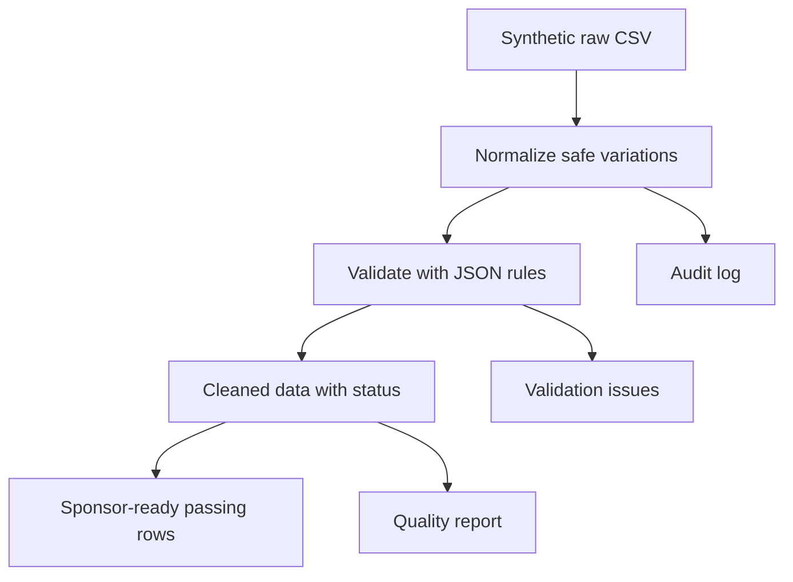

# Workflow and Controls

## Control principles

1. **Preserve source data:** the raw CSV is never edited by the pipeline.
2. **Configuration over hard-coding:** study rules are stored in JSON.
3. **Conservative cleaning:** only unambiguous aliases and formats are normalized.
4. **Traceability:** each automatic correction records the original and cleaned values.
5. **Controlled release:** failing records remain visible for reconciliation but are excluded from the sponsor file.
6. **Reproducibility:** the synthetic generator uses a fixed seed, and automated tests verify core behavior.

## Data-quality dimensions

- Completeness: required values are present.
- Uniqueness: sample identifiers are not duplicated.
- Validity: dates and numeric results use valid formats.
- Conformity: values match sponsor-approved categories and units.
- Integrity: only records passing all checks enter the deliverable.

## Compliance note

This portfolio project demonstrates general auditability and data-governance concepts. It is not a validated GxP system and does not claim compliance with FDA, GCP, GDPR, HIPAA, or any sponsor's production procedures.

